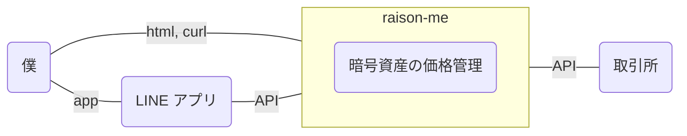
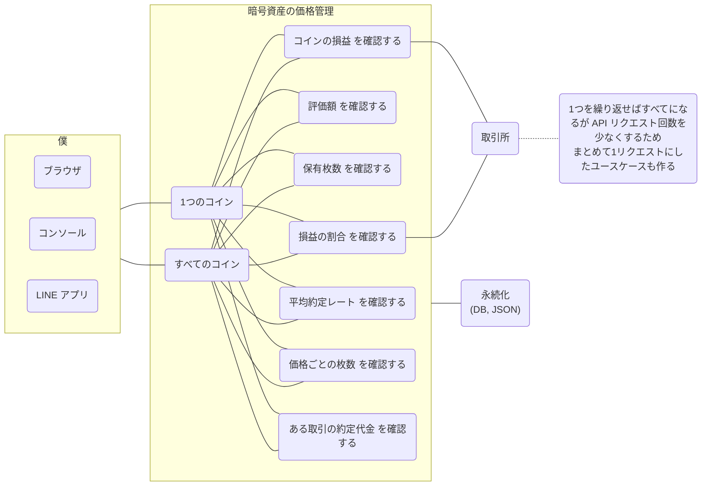
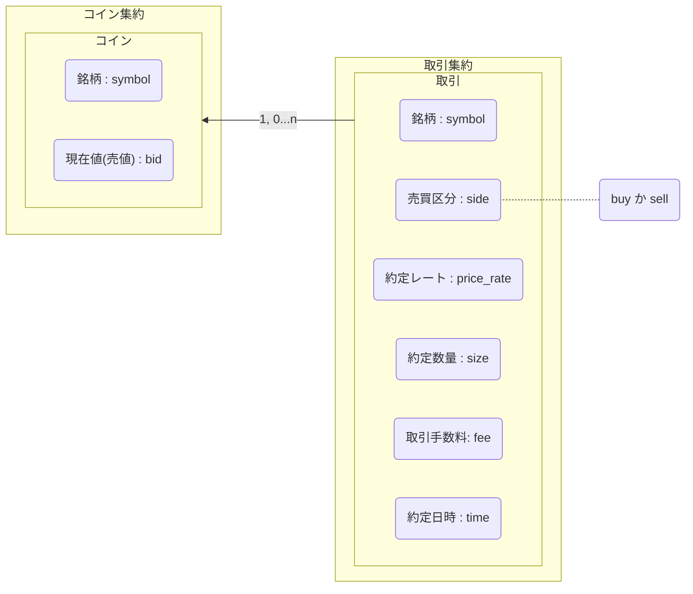
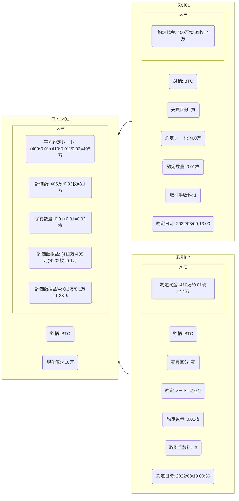
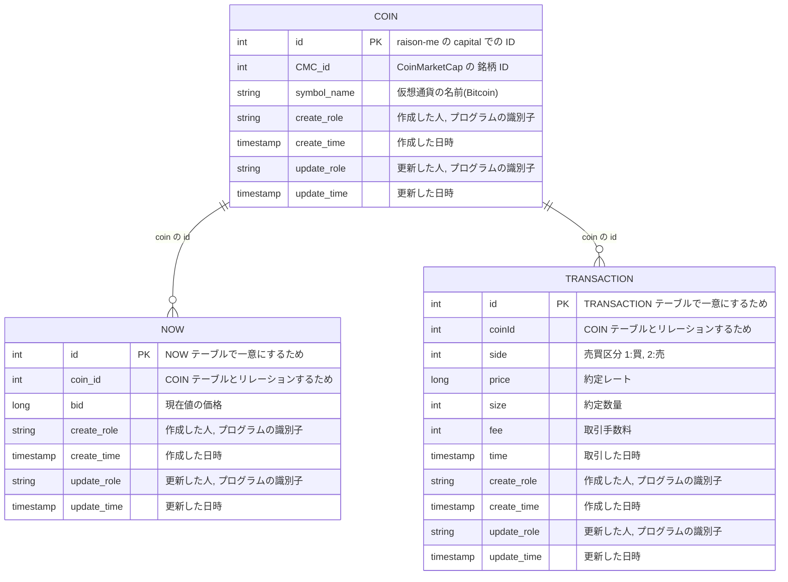

# crypto-assets
とりあえず イメージを起こしてみる  
## システム関連図

## ユースケース図

## ドメインモデル図

## オブジェクト図

## ER 図

## クラス図
mermaid から drawio で書いた [svg](./crypto-assets.svg) に変更  

ここには気になったことを書く  
- 命名がよくない  
-> cryptoAssetsPresen は ちゃんと apiController, htmlController などにした方がいい  
-> config は ちゃんと credential などにした方がいい  
- coinMarketCap の依存も外部なので 逆転させた方がいいかも?  
-> それを担うのが infra 層 だから 気にしなくていい?  
-> でも infra 層が分厚くなるというか 取得した Response を 加工する Logic がドメインから漏れている?  
-> infra 層 を難しく考えすぎてた笑 単純化できた  
- すると 現在値を coinMarketCap 以外から取得 や key を SecretManager 以外から取得 ができる?  
-> credential を保持する interface を用意して回避した  
- interface にするなら ドメイン層 まで持っていくべき?  
-> key value は infra 層でしか使わないから domain 層まで持っていかない  
- Presentation 層で 同じことをするって意味合いはどうやって表現するか?  
-> Usecase 層 の同じ interface を使っていることで表現できるかと  
- Usecase 層 は メソッド1個1個で interface で公開すべき?
-> 現時点ではあるまとまりで interface を作って 各 Controller に その interface を実装する
- Repository にDI するときに CMC か GMOCoin かを入れると切り替えができそう  
- LINE bot のために key が必要だが Secret Manager は infra 層 にあるから層を越えることになる  
  - SecretManager にアクセスするクラスは どの層からも使えるような場所を作る? -> 低凝集になる  
  - Presentation 層で SecretManager にアクセスするコードを書く? -> サービス内に同じことが書かれたコードが増え冗長  
  - credential interface を domain 層に持っていき Usecase 層を経由して使う? -> LINE bot で使えるかは使用方法の1種だからドメインほどコアではない  
-> key は環境変数みたいなものだからどこからアクセスしてもいい気がする, しかし コアに関係なく外界の環境のためにある  
-> よって infra 層の Share だけ どの層から呼んでも良いとする(絶対に各サービスを越える共通オブジェクトは作らない, 将来 各サービスごとに分離できなくなるから)  
- 中途半端に 本番環境と開発環境, テストとモック のことを考えているから冗長なコードが増えている?  
-> 勉強不足ではあるが とりあえず作りたいから作り進める  
- ファイル名の接頭辞に cryptoAssets_ が付与されていて cryptoAsset 以外のコンテキストを作ったときに名前空間が衝突する  
  - そもそもパッケージ名はアンダースコアや大文字が混ざるのは良くない  
  - 一般的に使われてる単語 crypto だけも良くない  
-> 妥協して cryptoAsset にする(domain/cryptoAsset など) 各層のファイルには `package cryptoAsset` と記述されるが諦める
-> 同じ `package cryptoAsset` と記述されるが ちゃんと名前空間は別になっている  
-> import するときに 別名で層の名前を付けて識別する  
-> 自分がどの層の cryptoAsset を編集しているかは ファイル名から判断する  
- capital/infrastructure/json にある LINE bot の key は LINE bot(テスト)  
-> LINE bot(本番)は GCP のSecret Manager  
-> テスト環境にデプロイしたら テスト環境 の SecretManager に保存された LINE bot(テスト)の key が使われるだけ  
- credential の interface は何を抽象化するのか  
-> 何の永続化ツール(db, JSON, GCP など)から入手した情報かを 区別しない  
-> ただ どのサービス(CoinMarketCap, LINE)のクレデンシャルかは 区別する  
- credential が テスト環境か 本番環境か 区別を抽象化したい  
-> 外部から infra 層で使いやすい形の Dto を作る  
-> その Dto を作るときに テスト環境か 本番環境か の boolen を渡して判別する  
- 正しい使い方じゃない気がするが 外部から取得して infra 層で使いやすい形に変換したものを XXXDto って名前つけがち  
- 詰め替えるときのメソッド名を generate にしがち(Create だと DI するときの init な雰囲気するから 使わない, make だと generate よりも軽く一部を抜き出しただけな感じ)  
- LINE の通信に必要な apiKey などは infra 層にする, ただ Presentation 層から infra 層へ依存するのはダメなので infra/Share という特別な package に配置する  
-> Presentation 層は 外部との内容に注力すべきであって 外部と通信するために必要なものは Presentation 層ではないと思うから infra 層にした  
- 命名規則というほどじゃないけど json をマッピングした struct には dataXXX って名前をつけがち  
- REST API にするために `http.HandleFunc()` の第2引数では http メソッドを固定することができない  
-> echo, gin は どうやって url の仕分けと http メソッド の仕分けを両立しているんだろう  
-> 勉強がしたいのか, 便利ツールを作りたいのか どちらを優先しようか
