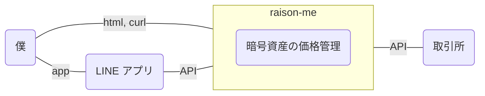
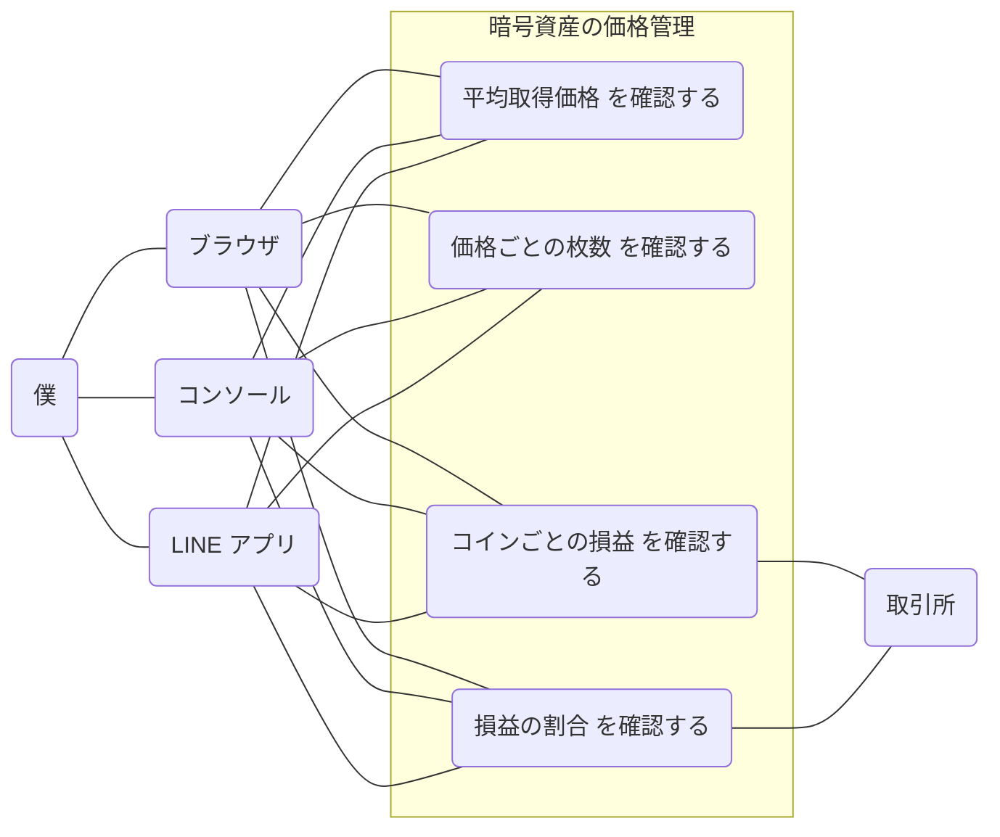
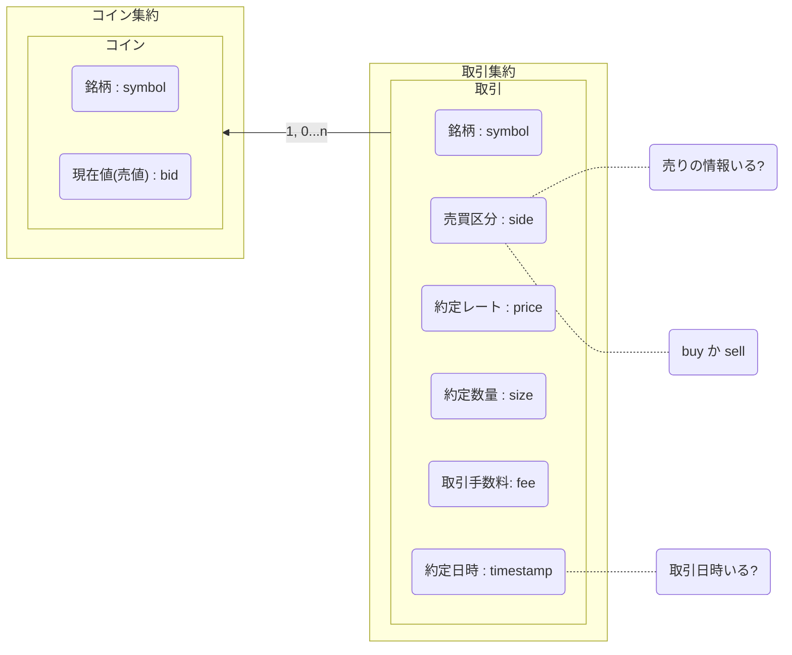
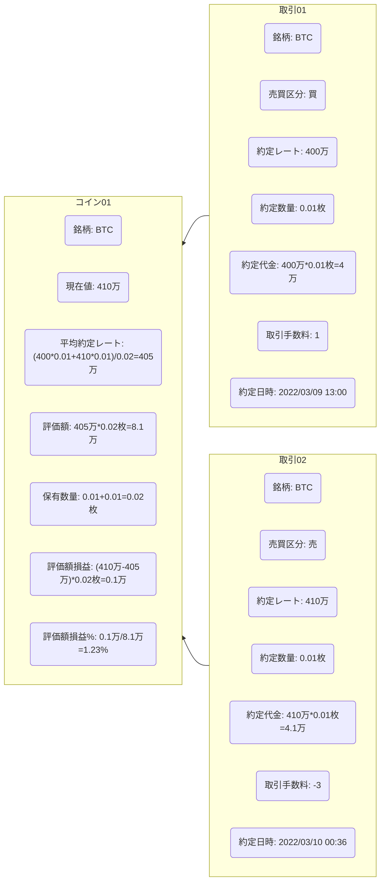
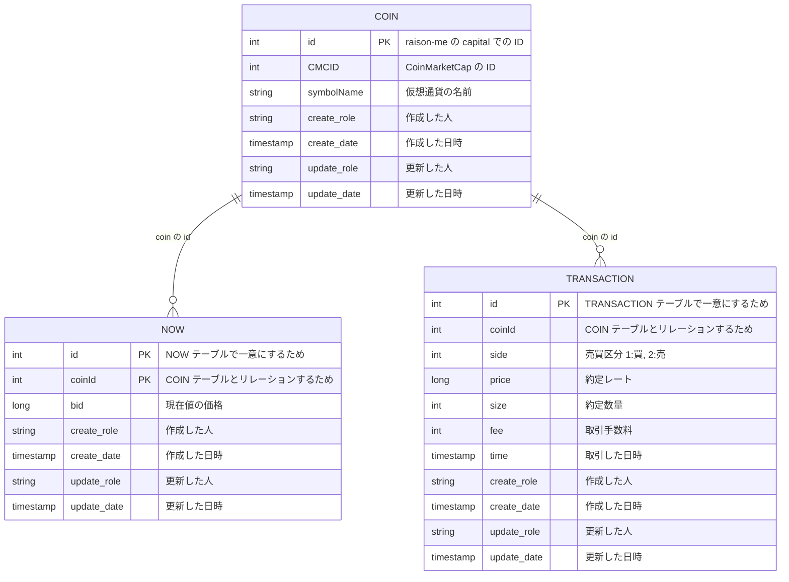

# crypto-assets
とりあえず イメージを起こしてみる  
## システム関連図

```mermaid
flowchart LR
  user(僕)
  line(LINE アプリ)

  user -- html, curl --- system
  line -- API --- system 
  user -- app --- line

  subgraph system [raison-me]
    direction TB
    service01(暗号資産の価格管理)
  end
  
  exchange(取引所)
  system -- API --- exchange
```
## ユースケース図

```mermaid
flowchart LR
  user(僕)
  browser(ブラウザ)
  console(コンソール)
  line(LINE アプリ)
  exchange(取引所)

  user --- line & browser & console
  browser & console & line --- use01 & use02 & use03 & use04
  use03 & use04 --- exchange

  subgraph system [暗号資産の価格管理]
    direction TB
    use01(平均取得価格 を確認する)
    use02(価格ごとの枚数 を確認する)
    use03(コインごとの損益 を確認する)
    use04(損益の割合 を確認する)
  end
```
## ドメインモデル図

```mermaid
flowchart RL
  transaction -- 1, 0...n ---> coin

  subgraph aggregation01 [コイン集約]
    subgraph coin [コイン]
      direction LR
      name_coin(銘柄 : symbol)
      now_price_bid("現在値(売値) : bid")
    end
  end

  subgraph aggregation02 [取引集約]
    direction LR
    subgraph transaction [取引]
      direction LR
      name_transaction(銘柄 : symbol)
      side(売買区分 : side)
      get_price(約定レート : price)
      size(約定数量 : size)
      fee(取引手数料: fee)
      time(約定日時 : timestamp)
    end
  end

question01("売りの情報いる?")
question01 -.- side
question02("取引日時いる?")
question02 -.- time
rule01("buy か sell")
rule01 -.- side
```
## オブジェクト図

```mermaid
flowchart RL
  transaction01 --> coin01
  transaction02 --> coin01

  subgraph coin01 [コイン01]
    direction LR
    name_coin(銘柄: BTC)
    price_now(現在値: 410万)
    get_price_average("平均約定レート: (400*0.01+410*0.01)/0.02=405万")
    price_btc(評価額: 405万*0.02枚=8.1万)
    mai_all(保有数量: 0.01+0.01=0.02枚)
    gain("評価額損益: (410万-405万)*0.02枚=0.1万")
    gain_percent(評価額損益%: 0.1万/8.1万=1.23%)
  end
  subgraph transaction01 [取引01]
    direction LR
    name_transaction01(銘柄: BTC)
    side_transaction01(売買区分: 買)
    get_price_transaction01(約定レート: 400万)
    mai_transaction01(約定数量: 0.01枚)
    price_transaction01(約定代金: 400万*0.01枚=4万)
    fee_transaction01(取引手数料: 1)
    time_transaction01(約定日時: 2022/03/09 13:00)
  end
  subgraph transaction02 [取引02]
    direction LR
    name_transaction02(銘柄: BTC)
    side_transaction02(売買区分: 売)
    get_price_transaction02(約定レート: 410万)
    mai_transaction02(約定数量: 0.01枚)
    price_transaction02(約定代金: 410万*0.01枚=4.1万)
    fee_transaction02(取引手数料: -3)
    time_transaction02(約定日時: 2022/03/10 00:36)
  end
```
## ER 図

```mermaid
erDiagram
  COIN {
    int id PK "raison-me の capital での ID"
    int CMCID "CoinMarketCap の ID"
    string symbolName "仮想通貨の名前"
    string create_role "作成した人"
    timestamp create_date "作成した日時"
    string update_role "更新した人"
    timestamp update_date "更新した日時"
  }
  NOW {
    int id PK "NOW テーブルで一意にするため"
    int coinId PK "COIN テーブルとリレーションするため"
    long bid "現在値の価格"
    string create_role "作成した人"
    timestamp create_date "作成した日時"
    string update_role "更新した人"
    timestamp update_date "更新した日時"
  }
  TRANSACTION {
    int id PK "TRANSACTION テーブルで一意にするため"
    int coinId "COIN テーブルとリレーションするため"
    int side "売買区分 1:買, 2:売"
    long price "約定レート"
    int size "約定数量"
    int fee "取引手数料"
    timestamp time "取引した日時"
    string create_role "作成した人"
    timestamp create_date "作成した日時"
    string update_role "更新した人"
    timestamp update_date "更新した日時"
  }
  COIN ||--o{ NOW : "coin の id"
  COIN ||--o{ TRANSACTION : "coin の id"
```
