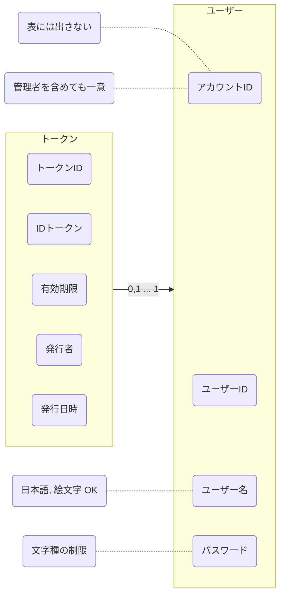
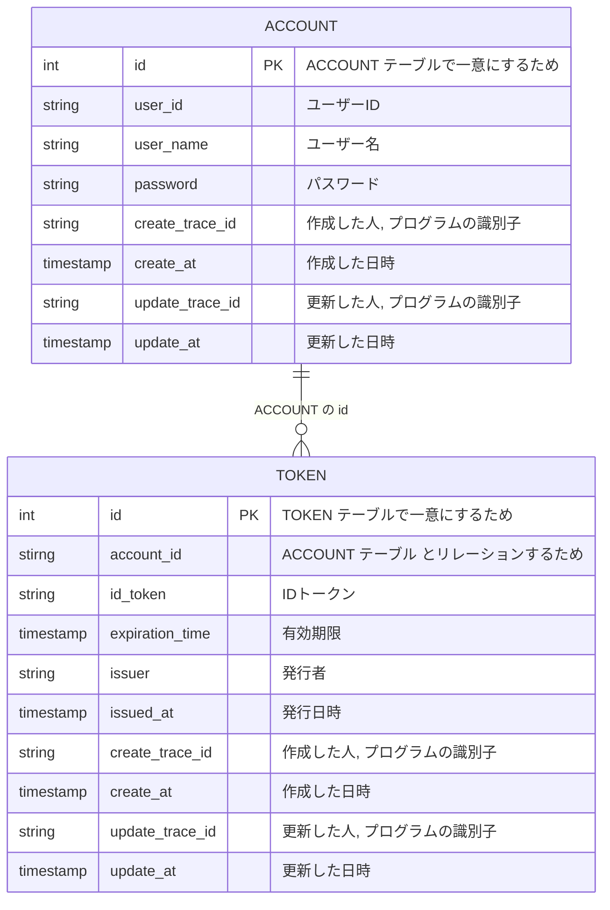

# 認証管理
[よくわかる認証と認可](https://dev.classmethod.jp/articles/authentication-and-authorization/)  
認証(Authentication: AuthN)  
認可(Authorization: AuthZ)  

アクセストークン は 認可(authZ)のコンテキストとする  
## システム関連図
## ユースケース図
- ユーザー を新規作成できる
- ユーザー を削除できる
- ユーザー でログインできる
- ユーザー(自分) の情報を更新できる
  - ユーザーID
  - ユーザー名
  - パスワード
  - IDトークン
- IDトークン の 発行 ができる
- IDトークン の 無効化 ができる

まずは __限られた人にしか見れない__ という状態にする  
## ドメインモデル図


ユーザーID を変えられるように アカウントID を作った  
だけど ユーザーID も一意にならないと メンションができない  
そもそも一意になりそうな値をハッシュ化する?  
アカウントID は表に出さない値だから どんなのでもいい  

IDトークン に 有効無効区分 は必要か?  
IDトークン を使わなくなったとき 論理削除 or 物理削除 どちらにするか?  
物理削除 だと ストレージを減らせるし 何度も作り直せるから物理削除にしよう  

トークンオブジェクト に 有効期限, 誰が発行したか, 備考 を保存できるようにするか?  
JWT の規格を確認してみよう  
[IDトークンが分かれば OpenID Connect が分かる](https://qiita.com/TakahikoKawasaki/items/8f0e422c7edd2d220e06)  

ついつい DB のことまで考えて key とか どっちのテーブルにIDを持つか とか考えてしまう  
あくまで オブジェクト として考えないといけない  
## オブジェクト図
オブジェクト図は 具体的値, ドメインモデル図 は英語名 も書く  
出てくる名詞をとりあえず オブジェクト として考えてみるといい感じ  
## ER 図

## クラス図

## 開発中のメモ
- 費用対効果を考えて 何を 値オブジェクト にするか?  
  - Account の ID  
  - userID  
  - userName  
  - password  
- entity の 戻り値は ポインタがいいのか?  
- 引数は同じ型なら省略して書けるけど 後で型を変える可能性があるから分けておこうかな  
- struct を宣言するとき フィールド名 を省略しないほうがよい 省略してて フィールド増えるとエラーになる  
  -> むしろエラーになった方がいい? ゼロ値を設定するからエラーにならなくてもいい?  
- テストコード どこにどうやって書こう?  
- date_value をテキトーに string にしてるから ちゃんと go の時間を扱うオブジェクトにしたい  
- 値オブジェクト の生成責務は entity の コンストラクタ or usecase の利用側 の どちらだろう  
  -> それが ドメイン知識 ならドメイン層で プログラミング上なら どちらでもいいのでは  
- 戻り値が ポインタじゃないなら nil を返せず ゼロ値 を返さなければならない  
  - err を返すときに nil を返せないのは不便?  
  -> とりあえず Repository の 戻り値を ポインタ にして nil を返せるようにする  
- 独自例外も定義したい  
- アカウントとか nil, err を返していいの?  
- やっぱり user オブジェクトにして アカウントID を保持させつつ それを key にするって方がドメインに合いそう  
- やっぱり userID を key にした方が良さそう, でも ユーザーID が変更できなくなる...
- ユーザー に 最終ログイン日 を持たせたい  
- セキュリティの観点の話始める?  
- アクセス IPアドレス とか保持した方がいい?  
- ユーザーID はシステム上の制限じゃなくて 機能的意味合い  
- Repository に 保存する って作ると Delete と少し意味が被る? json で操作してるからか?  
- infra 層でポインタを返すのは危険では? だって 同じ構造体を触る可能性がある  
- Repository で interface の合成を使うと 何系の処理なのか分かりやすくなる気がする  
- 合成もとは private な interface でいいかも  
- 値オブジェクト を作りすぎた  
  - Go を使っているのだから 別ファイルにせず 関連性の強いファイル内で書けばよい  
  - 値オブジェクト は 非可換 なものを扱うから 属性値 は向いてないかも  
  -> 値オブジェクト にしたいのか 型安全 が欲しいだけか ちゃんと見極めること  
- interface を細かく作りすぎた  
  - interface の合成は そんなに使わない方向で考えるほうが良さそう  
- ユーザー と ユーザープロファイル と 認証情報 は分けた方がいいらしい  
- json を読み書きする方法は複数種類あるけど どれがいいだろう?  
- 迷っている chi を読んで車輪の再発明をするか chi を使ってしまうか  
  -> 自分へのサービス提供を優先するなら chi を使ってしまった方がいい...  
  -> chi を読んでみたって記事を書くなら 読んでもいいかもしれんけど まだ記事を書くつもり無いから 今は chi を使うか笑  
  - やってることは ServeMux 作って Handler 実体は `ServeHTTP(ResponseWriter, *Request)` を登録して 呼び出すだけ  
  - フツーは pattern と `http.HandleFunc` を登録するのを 3項目目 として http メソッド を足すだけ  
  -> 標準ライブラリだけで 作ろうと 色々考えたけど やっぱり面倒くさくなったから chi を使う笑 __でもいつか chi を読んで記事を書きたい__  
- chi は 異なるパッケージで同じライブラリじゃないと動かないらしい 片方が "github.com/go-chi/chi/v5" もう片方が "github.com/go-chi/chi" なら 認識されない  
  - セマンティックバージョニング だから v4 と v5 は後方互換 が無く 同じ名前の別パッケージ  
  -> よって import でも v5 って明記した方が下手にバグるより前に 修正が必要とエラーになる  
- chi の導入の判断が早すぎた? 必要に迫られてからでもよかった? だって 標準ライブラリ から chi にするのは苦労しない  
- 標準ライブラリ で サブルーター を作るのはどうするんだろう  
- 1URL = 1構造体 = 1 ファイル = http メソッド分の usecase でいいのか?  
- chi に合う 認証のミドルウェア 作らないとな  
- chi で Post で値を取り出す方法は?  
- Request の値を entity に変換するのは どの層の役割か? presen 層? usecase 層?  
  -> バリデーション はどの層で? じゃなくて 層の責務に応じたバリデーションをする  
- Go 言語の flag パッケージ を上手に使えないかな?  
- 疑似 PUT にする リクエストヘッダー の実装(Java のため)  
- URL に対して JSON 構造を送ってくるときは body = JSON か!w  
  - body = JSON なら `Content-Type: application/json` にしないといけない  
- なんか salt するための値を取ってくる方法が上手じゃない気がするけど とりあえず 作る笑  
- __UserName で salt しちゃダメじゃね?w__  
__次はここから考える__  


なんか Post して Go で受けとるのが上手にできなかった  
POST のときに 以下で試したけど `application/x-www-form-urlencoded` じゃないとうまくいかないっぽい  
- Content-Type: application/json
- Content-Type: multipart/form-data
- Content-Type: application/x-www-form-urlencoded

[Content-Typeの一覧](https://qiita.com/AkihiroTakamura/items/b93fbe511465f52bffaa)  

なんか色々受け取り方があるらしい?  
```go
r.Form.Get("category")
r.FormValue("category")
r.PostFormValue("category")
```
どれも `r.ParseForm()` を実行した後じゃないとダメ?  

ParseForm をしないで post の値は取れない?  
postする側(htmlまたはjs)が multipart/form-data だと値は取れない?  
multipart/form-data の場合 ParseMultipartForm で処理する?  

URL パラメータだと どれでも値が取れる  
渡してるデータが json の形してるのも問題?  

[フォーム](https://www.twihike.dev/docs/golang-web/forms)  
- Form  
- PostForm  
- MultipartForm  
- FormValue  
- PostFormValue  
- FormFile  
`r.Form()` と `r.PostForm()` には `r.ParseForm()` が必要  
`r.MultipartForm()` には `r.ParseMultipartForm()` が必要  
通称フォーム は `Content-Type: application/x-www-form-urlencoded` らしい  
`r.Form()` と `r.PostForm()`
- `application/x-www-form-urlencoded` しか対応してない  
- key の列挙ができる  

`r.Form()` は URLパラメータ と name属性の値 があったら 両方送信されてくる  
`r.PostForm()` は name属性の値 で上書きされる  

`r.FormValue()` と `r.PostFormValue()`
- `r.ParseForm()` や `r.ParseMultipartForm()` を自動でやってくれる  
- `application/x-www-form-urlencoded` と `multipart/form-data` に自動対応  
- key の列挙ができない  
- 同じ key に複数の値があっても 最初の値しか取得してくれない  
- FormValue は フォーム で で name属性の値 が URLクエリ文字列 より 優先  
- FormValue は マルチパートフォーム で URLクエリ文字列 が name属性の値 より 優先  
- PostFormValue は name属性の値 が優先  


struct に使う単語のニュアンス整理  
定義: この struct の フィールド名 は〇〇で 型は〇〇で... って感じ  
宣言: メソッド内で struct に値を入れて変数にする感じ?  
生成: New な感じ, コンストラクタ に近い  
格納: setter な感じ  
