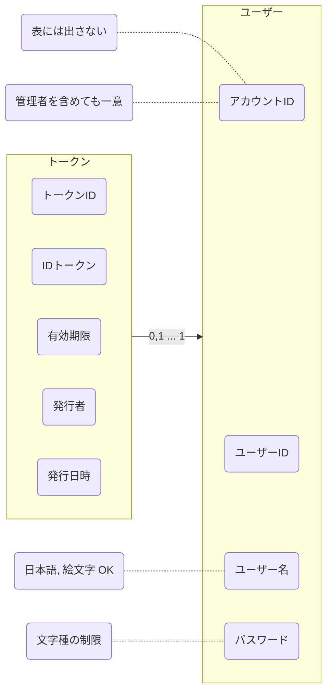

# 認証管理
[よくわかる認証と認可](https://dev.classmethod.jp/articles/authentication-and-authorization/)  
認証(Authentication: AuthN)  
認可(Authorization: AuthZ)  

アクセストークン は 認可(authZ)のコンテキストとする  
## システム関連図
## ユースケース図
- ユーザー を新規作成できる
- ユーザー を削除できる
- ユーザー でログインできる
- ユーザー(自分) の情報を更新できる
  - ユーザーID
  - ユーザー名
  - パスワード
  - IDトークン
- IDトークン の 発行 ができる
- IDトークン の 無効化 ができる

まずは __限られた人にしか見れない__ という状態にする  
## ドメインモデル図

ユーザーID を変えられるように アカウントID を作った  
だけど ユーザーID も一意にならないと メンションができない  
そもそも一意になりそうな値をハッシュ化する?  
アカウントID は表に出さない値だから どんなのでもいい  

IDトークン に 有効無効区分 は必要か?  
IDトークン を使わなくなったとき 論理削除 or 物理削除 どちらにするか?  
物理削除 だと ストレージを減らせるし 何度も作り直せるから物理削除にしよう  

トークンオブジェクト に 有効期限, 誰が発行したか, 備考 を保存できるようにするか?  
JWT の規格を確認してみよう  
[IDトークンが分かれば OpenID Connect が分かる](https://qiita.com/TakahikoKawasaki/items/8f0e422c7edd2d220e06)  

ついつい DB のことまで考えて key とか どっちのテーブルにIDを持つか とか考えてしまう  
あくまで オブジェクト として考えないといけない  
## オブジェクト図
オブジェクト図は 具体的値, ドメインモデル図 は英語名 も書く  
出てくる名詞をとりあえず オブジェクト として考えてみるといい感じ  
## ER 図

## クラス図
