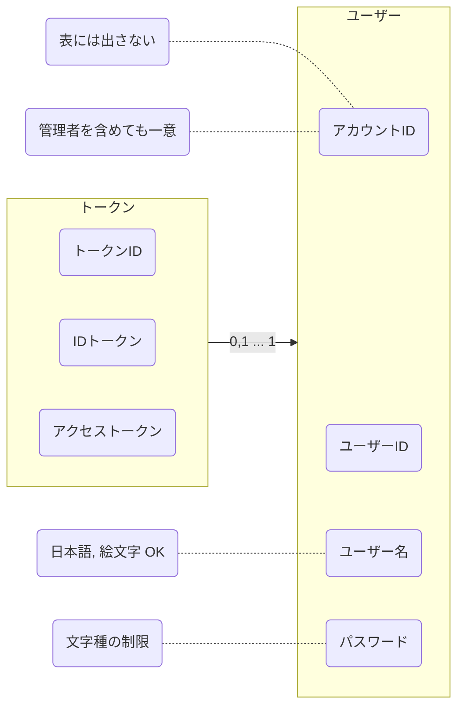
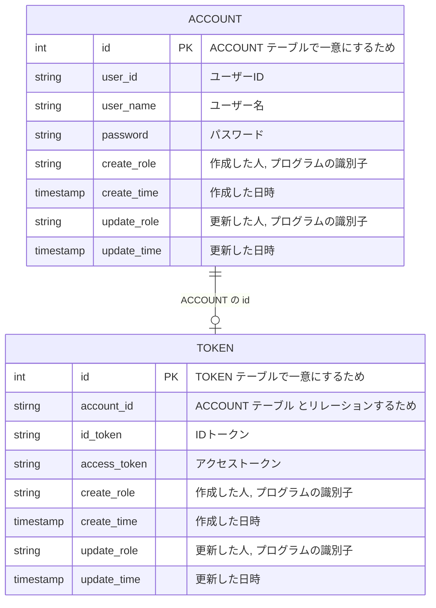

# アカウント管理
アカウント管理 じゃなくて 認証管理?

IDトークン に 有効無効 区分は必要?
レコード削除はいささか乱暴? 論理削除にする? データ量削減しちゃう?
有効期限を付ける?
どこで使うために発行された IDトークン か分かるようにする?
備考を付ける?
JWT の規格に合わせる?
[よくわかる認証と認可](https://dev.classmethod.jp/articles/authentication-and-authorization/)
認証(Authentication: AuthN)
認可(Authorization: AuthZ)
## システム関連図
## ユースケース図
- ユーザー を新規作成できる
- ユーザー を削除できる
- ユーザー でログインできる
- ユーザー(自分) の情報を更新できる
  - ユーザーID
  - ユーザー名
  - パスワード
  - IDトークン
  - アクセストークン
- IDトークン の 発行 ができる
- IDトークン の 無効化 ができる
- アクセストークン の 発行 ができる
- アクセストークン の 無効化 ができる

まずは __限られた人にしか見れない__ という状態にする  
## ドメインモデル図

ユーザーID を変えられるように アカウントID を作った  
だけど ユーザーID も一意にならないと メンションができない  
そもそも一意になりそうな値をハッシュ化する?  
アカウントID は表に出さない値だから どんなのでもいい  

ついつい DB のことまで考えて key とか どっちのテーブルにIDを持つか とか考えてしまう  
あくまで オブジェクト として考えないといけない  
## オブジェクト図
オブジェクト図は 具体的値, ドメインモデル図 は英語名 も書く  
出てくる名詞をとりあえず オブジェクト として考えてみるといい感じ  
## ER 図

## クラス図
