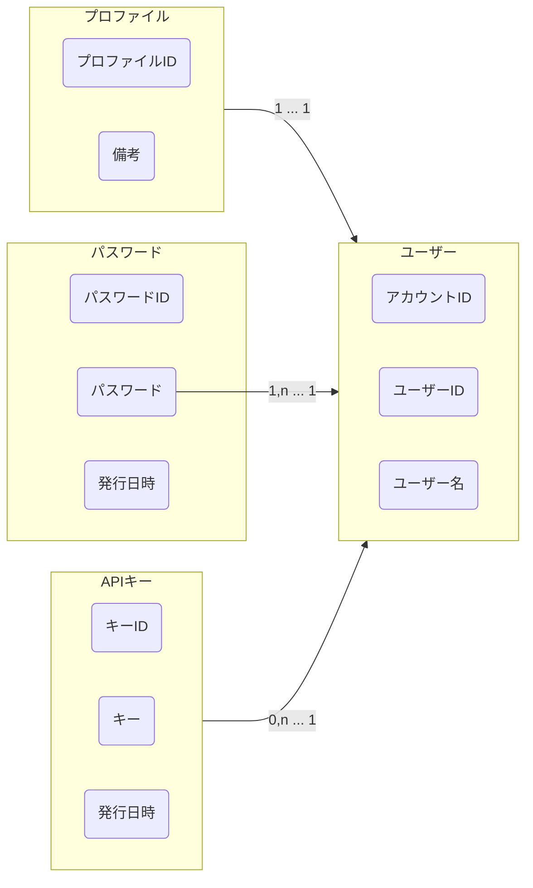

# 認証管理
[よくわかる認証と認可](https://dev.classmethod.jp/articles/authentication-and-authorization/)  
認証(Authentication: AuthN)  
認可(Authorization: AuthZ)  

アクセストークン は 認可(authZ)のコンテキストとする  

一度全部作り直す  
なぜなら 認証をパスワード以外も対応したいから  
## ドメインモデル図

プロファイル は過剰機能だから 最初は実装しない  
## 開発中のメモ
ドメイン層 で発生する例外を作らないとなぁ  
enum の 作り方とかあったなぁ  
テストコードはインタフェースに対して作るのがよい  
ログ出力ミドルウェア  
コンフィグファイル  

値オブジェクトのファイル名を xxx_value.go にしたのは失敗だったかも  
テストファイルが xxx_test.go って書くから めちゃめちゃ長くなる  
