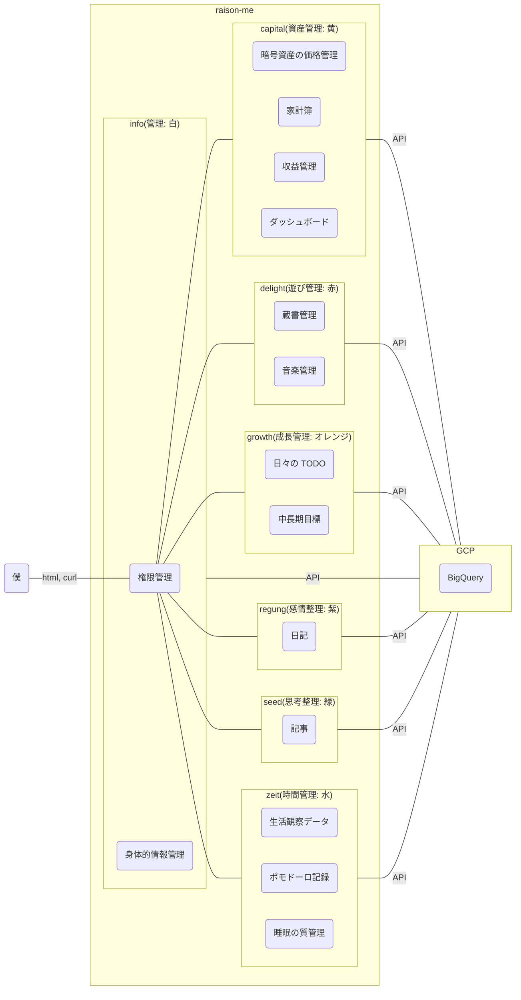
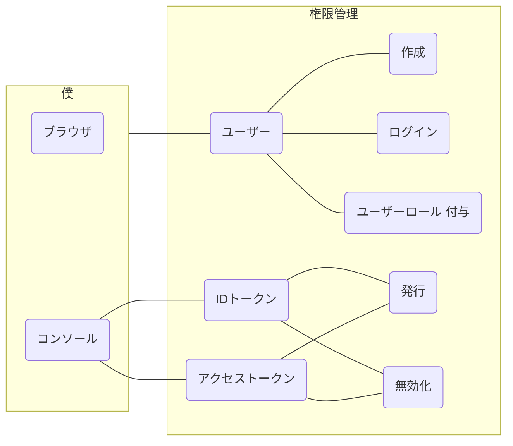
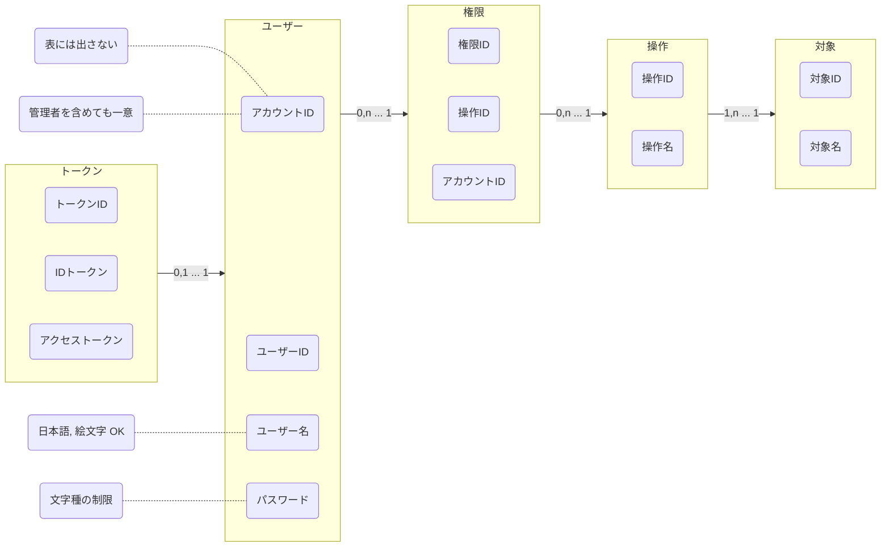

# 認可管理
[よくわかる認証と認可](https://dev.classmethod.jp/articles/authentication-and-authorization/)  
認証(Authentication: AuthN)  
認可(Authorization: AuthZ)  

IDトークン は 認証(authN)のコンテキストとする  

__認証管理 を作った後に また考え直す__  

権限種類は ACL, RBAC, ABAC のどれにするか  
ABAC が一番柔軟だけど 実装が大変になるし 最初からそこまで必要か?って気持ち  
ロールを細かくして 属性も運用でカバーできないかな?w  
でも 対象グループとか権限グループとか作りたいなら ABAC になる気がする  
そのユーザーが〇〇対処グループに属しているとか  
RBAC から ABAC へ切り替える方法がイメージできるなら RBAC から始めてもいいかも?  
権限まわりの知見や具体的な使用方法がイメージできないから とりあえずは __RBAC__ から始めよう!  

権限アーキテクチャは PEP は 各サービスの方で info に PAP, PIP, PRP, PDP を実装したい  
-> PEP は 各サービスの方にも存在すると思ったけど そうじゃないかも?  
だって 全部一度 info の処理通るんだから そこで権限ありませんって返せばそれまでなのかも  

info にとっては 権限管理はドメイン知識になるっぽいから クリーンアーキテクチャ で考えればいいかも  

実装技術の話をすれば 認証(ユーザー確認)と認可(権限)の両方を実装したい  
OpenID Connect を実装しようとすれば ID Token(認証) も Access Token(認可) も返すことになる  
JWT は 認証も認可も同時に行って返すものっぽい  
まぁ第三者に Raison-me の会員情報を使って何かするってしなくても JWT にしたら今どきっぽくて面白そう笑  

PayPal は `アクセスポイント/v1/oauth2/token` に  
Authorization ヘッダー へ ClientID, Secret の Base64 を格納して POST する  
レスポンスに Access Token を含んだ JSON が返ってくるみたい  
その Access Token で 注文作成をする  
Access Token は JWT の形してなさそう?  

名称をどうしよう  
アカウント管理?, 権限管理?, 認証基盤?  
認証と認可の両方を兼ねている  
アカウント管理だと ちょっと概念が広すぎる気がする?  
ユースケース図を考えてからでもいいかな  

英語名は auth-control にする  
認証(authentication), 認可(authorization) で どちらも auth が含まれてるからいいかな笑  
## システム関連図

## ユースケース図
まずは箇条書きで洗い出す  
その中から実装する最低限の機能を考える  
__〇〇できる__ で洗い出す
### 権限管理しそうな対象(コンテキスト)  
- capital(資産管理: 黄)
  - 暗号資産の価格管理
  - 家計簿(何に使ったか)
    - 現金支払い
    - クレカ
  - 収益管理
    - 銀行口座
    - 証券口座
    - 暗号資産の収益
  - ダッシュボード(データビジュアライゼーション?)
    - 米国株 トレンド
    - 暗号資産 トレンド
    - NFT トレンド
- delight(遊び管理: 赤)
  - 蔵書管理
  - 音楽管理
- growth(成長管理: オレンジ)
  - 日々の TODO
  - 中長期目標
- info(管理: 白)
  - 権限管理
  - 身体的情報管理
- regung(感情整理: 紫)
  - 日記
- seed(思考整理: 緑)
  - 記事
    - 資産運用 で思ったこと
    - 仕事マインド で思ったこと
    - プログラミングの勉強 で思ったこと
    - NFT で思ったこと
- zeit(時間管理: 水)
  - 生活観察データ
  - ポモドーロ記録
  - 睡眠の質管理
### ユースケースで考えられるもの
アカウント の属性として ユーザーと管理者 に分ける?  
区分を間違えると 一般ユーザーに管理者権限を付与する事故が起こりそう  
テーブル分けても 使うテーブルを間違えたら同じこと?  
管理者には必要だけど ユーザーには必要ない項目とかあって 同じテーブルにすると面倒くさくなりそうだから分けるか  
あとから合わせる方がまだ簡単そう  
-> アカウント という概念があって 区分によって ユーザー or 管理者 に切り替わるわけではない  

ユーザー とは: 一般人が自由に作れるアカウント  
管理者 とは: ユーザーを管理するアカウント  
ユーザーロール とは: ユーザー の 対象情報(コンテキスト) に対する操作のこと  
操作 とは: 閲覧, 編集, (削除いるかな?)  
管理者ロール とは: _未定_  

ユーザーロール を付与したユーザー 同士の繋がりをなんて表現しよう?  
信頼ユーザー?w フォロワー?  
一般業界に合わせて フォロワー と呼称しよう  
フォロー: 任意のユーザー(B) が ユーザー(A) に ユーザーロール を要求すること  
フォロワー: ユーザー(A) が ユーザーロール を付与した 任意のユーザー(B)のこと  

ユーザーロール に 一般公開 が必要  

権限にレベルって概念が必要かと思っていたが 付与する権限グループが実質レベルみたいなものになる?  
情報公開段階っていう方が正しい?  
閲覧者, ユーザー, システム管理者 の方が正確かも?  
ユーザー は 他のユーザーの 閲覧者 になる  
あるユーザーは他のユーザー(複数)の 情報公開段階を持っている  
-> ユーザーロール レベル, 管理者ロール レベル はどうしよう?, ある情報にマスクかけたりするか?  
-> 需要があってからにしよう  

権限グループ  
-> 最初は権限グループなんて作らず 1個ずつ全部を付与してもらおう笑  
#### ユーザー
- ユーザー を新規作成できる
- ユーザー を削除できる
- ユーザー でログインできる
- ユーザー(自分) の情報を更新できる
  - ユーザー名
  - パスワード
- ユーザーロール の一覧を確認できる
- ユーザー が 任意のユーザー に ユーザーロール を付与できる
- ユーザー が 任意のユーザー(フォロワー) の ユーザーロール を剥奪できる
- ユーザー が 任意のユーザー に ユーザーロール を要求(フォロー)できる
- フォロワー(ユーザーロール を付与した ユーザー) の一覧を確認できる
- フォロワー が いつ どのコンテキストを 操作したか確認できる

- IDトークン の 発行 ができる
- IDトークン の 無効化 ができる
- アクセストークン の 発行 ができる
- アクセストークン の 無効化 ができる
#### 管理者
- 管理者 を新規作成できる
- 管理者 を削除できる
- 管理者 でログインできる
- 管理者(自分) の情報を更新できる
  - パスワード
- 管理者 に 管理者ロール を付与できる
- 管理者ロール を剥奪できる
- ユーザー一覧 を閲覧できる
- ユーザー ができることをすべてできる
  - ユーザー に ユーザーロール を付与できる
  - ユーザー の ユーザーロール を剥奪できる
  - ユーザー を新規作成できる
  - 任意のユーザー を削除できる
- 任意のユーザー を凍結できる
- 管理者 がいつログインしたか確認できる
- 任意のユーザー の フォロワー が いつ どのコンテキスト を操作したか確認できる
#### 技術的
- Authorizationヘッダー で 認証認可 を通す
- アクセスキーの発行
  - JWT を返す
- info から 公開鍵を配布しないといけない
- info に 秘密鍵 を保持しないといけない
- 2段階認証
- SNS認証
### 整理
最低限の機能  
- ユーザー の作成
- ユーザー でログイン
- IDトークン の 発行 ができる
- IDトークン の 無効化 ができる
- アクセストークン の 発行 ができる
- アクセストークン の 無効化 ができる

管理者 や 削除 は 最初は作らない DB を直接操作することにする  
まずは __限られた人にしか見れない__ という状態にする  
### ユースケース図

## ドメインモデル図

ユーザーID を変えられるように アカウントID を作った  
だけど ユーザーID も一意にならないと メンションができない  
そもそも一意になりそうな値をハッシュ化する?
アカウントID は表に出さない値だから どんなのでもいい

あれ 権限とユーザーが循環してて良くない?  
消そうとしたときに 鶏が先か卵が先か 問題になってしまう?  
ユーザーが存在しないと 権限が存在できなくてダメ  
権限 の アカウントID と ユーザー の アカウントID が同じことになってもいい?  
ドメインモデル図 の時点で テーブル構成を考えてしまっている?  

__もしかして ユーザー管理 と 権限管理 はドメインが別か?__
__僕はまず ユーザー管理 ができるようにならないといけない__

ついつい DB のことまで考えて key とか どっちのテーブルにIDを持つか とか考えてしまう  
あくまで オブジェクト として考えないといけない  
## オブジェクト図
オブジェクト図は 具体的値, ドメインモデル図 は英語名 も書く  

出てくる名詞をとりあえず オブジェクト として考えてみるといい感じ?
対象, ユーザー, ユーザーロール の3次元か?

ユーザー 1個に対して トークン1個がフツーだよな
そのユーザーが複数いるだけか!
1ユーザーが複数トークンを生成できてるように見えるのは 管理者ロールを持ってるからか!

だれのユーザーロールかって情報が必要?
アカウントID(主), ユーザーロールID, アカウントID(フォロワー)
2個で 一意が特定できるテーブルが必要?

__考えすぎると疲れるから とりあえずログインできればいいか笑__
## ER 図
## クラス図
